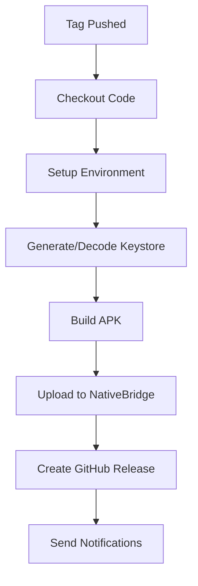

# NativeBridge CI/CD Integration Guide

This document explains how NativeBridge API is integrated into this project's CI/CD pipeline.

## Table of Contents
1. [Overview](#overview)
2. [Setup Instructions](#setup-instructions)
3. [How It Works](#how-it-works)
4. [Configuration](#configuration)
5. [Testing the Integration](#testing-the-integration)
6. [Troubleshooting](#troubleshooting)

---

## Overview

This project automatically uploads APK builds to the NativeBridge platform when you create a release tag. The integration:

- ✅ Builds Android APK on every release tag push
- ✅ Uploads APK to NativeBridge automatically
- ✅ Generates magic link for **instant cloud testing**
- ✅ Sends email notifications to your team
- ✅ Creates GitHub Release with NativeBridge cloud link
- ✅ Handles errors gracefully

### What is NativeBridge?

**NativeBridge** is a cloud platform that lets you **run Android apps instantly in your browser** without any installation:

- ☁️ **Cloud Emulators** - Test on virtual Android devices instantly
- 📱 **Real Physical Devices** - Run on actual Android hardware in the cloud
- 🚀 **One-Click Launch** - No setup, no downloads, just click and test
- 🌐 **Universal Access** - Works on any platform (Windows, Mac, Linux, mobile)
- 🔗 **Shareable Links** - Send magic links to anyone for instant testing

**Workflow File:** [`.github/workflows/release-build.yml`](.github/workflows/release-build.yml)

---

## Setup Instructions

### Step 1: Get Your NativeBridge API Key

1. Log in to [NativeBridge](https://nativebridge.io)
2. Go to the **API Keys** section: https://nativebridge.io/dashboard/api-keys
3. Click **Generate New API Key** or **Create API Key**
4. Copy the API key (starts with `sk_live_...` or `sk_test_...`)

> ⚠️ **Important:** Keep this key secure and never commit it to your repository!

### Step 2: Add API Key to GitHub Secrets

1. Go to your GitHub repository
2. Navigate to **Settings** → **Secrets and variables** → **Actions**
3. Click **New repository secret**
4. Add the following secret:

| Secret Name | Value |
|------------|-------|
| `NATIVEBRIDGE_API_KEY` | Your API key from Step 1 |

**Screenshot Guide:**
```
Repository Settings
  └── Secrets and variables
       └── Actions
            └── New repository secret
                 ├── Name: NATIVEBRIDGE_API_KEY
                 └── Secret: sk_live_xxxxxxxxxxxxx
```

### Step 3: Verify Setup

The integration is already configured in the workflow! You just need to add the API key secret.

---

## How It Works

### Workflow Trigger

The CI/CD pipeline triggers when you push a **release tag**:

```bash
# Create and push a release tag
./scripts/release.sh 1.0.6
```

This will:
1. Bump version in `package.json` and `android/app/build.gradle`
2. Commit the changes
3. Create and push tag `v1.0.6`
4. **Trigger the GitHub Actions workflow**

### Build Process

The workflow performs these steps in order:



#### Detailed Steps:

1. **Setup Environment**
   - Node.js 18
   - JDK 17
   - Gradle

2. **Keystore Configuration**
   - Uses `ANDROID_KEYSTORE_BASE64` secret if configured
   - Otherwise generates temporary keystore for CI

3. **Build APK**
   - Fixes Kotlin compilation warnings
   - Builds release APK
   - Signs with keystore

4. **Upload to NativeBridge** ⭐
   - Uploads signed APK via API
   - Uses default settings:
     - `accessType`: `public`
     - `versionAction`: `create_new_version`
     - `sendNotification`: `true`
     - `notificationEmails`: None (sends to uploader's email)
   - Parses response to extract magic link

5. **Create GitHub Release**
   - Attaches APK file
   - Includes NativeBridge magic link in release notes
   - Shows version information

### NativeBridge Upload Configuration

The upload step is configured as follows:

```yaml
- name: Upload APK to NativeBridge
  env:
    NATIVEBRIDGE_API_KEY: ${{ secrets.NATIVEBRIDGE_API_KEY }}
  run: |
    curl -X POST https://dev.api.nativebridge.io/v1/application \
      -H "X-Api-Key: $NATIVEBRIDGE_API_KEY" \
      -F "file=@release-artifacts/NativeBridge-v${VERSION}.apk" \
      -F "accessType=public" \
      -F "versionAction=create_new_version" \
      -F "sendNotification=true"
```

**Parameters Used:**

| Parameter | Value | Reason |
|-----------|-------|--------|
| `file` | APK file | Direct file upload |
| `apkUrl` | None | Not using URL upload |
| `accessType` | `public` | Anyone with link can install |
| `allowedUsers` | None | Not needed for public access |
| `versionAction` | `create_new_version` | Create new version of existing app |
| `sendNotification` | `true` | Email notifications enabled |
| `notificationEmails` | None | Sends to uploader's email (API key owner) |

---

## Configuration

### Customizing Upload Behavior

You can modify the upload behavior by editing [`.github/workflows/release-build.yml`](.github/workflows/release-build.yml):

#### Make App Private

```yaml
-F "accessType=private" \
-F "allowedUsers=dev@company.com" \
-F "allowedUsers=qa@company.com"
```

#### Disable Email Notifications

```yaml
-F "sendNotification=false"
```

#### Send Notifications to Specific Emails

```yaml
-F "sendNotification=true" \
-F "notificationEmails=qa-team@company.com" \
-F "notificationEmails=product@company.com"
```

#### Create New App Entry (Instead of New Version)

```yaml
-F "versionAction=create_new_app"
```

### Skipping NativeBridge Upload

If you don't configure `NATIVEBRIDGE_API_KEY`, the workflow will:
- ✅ Still build the APK
- ✅ Still create GitHub Release
- ⚠️ Skip NativeBridge upload (with warning message)
- ✅ Continue execution without failing

This allows you to test the pipeline before setting up NativeBridge integration.

---

## Testing the Integration

### Test 1: Dry Run (Local)

Test the release script locally without pushing:

```bash
./scripts/release.sh 1.0.6 --dry-run
```

This will show what would happen without actually creating tags.

### Test 2: Full Release

Create an actual release:

```bash
./scripts/release.sh 1.0.6
```

### Test 3: Monitor Workflow

1. Go to **Actions** tab in GitHub
2. Click on the running workflow
3. Monitor the **Upload APK to NativeBridge** step
4. Check for success messages:
   ```
   📤 Uploading APK to NativeBridge...
   ✅ Successfully uploaded to NativeBridge!
   📱 App ID: abc123
   🔢 NativeBridge Version: 1.0
   🔗 Magic Link: https://nativebridge.io/app/abc123
   ```

### Test 4: Verify Magic Link

After successful upload:
1. Check the GitHub Actions summary
2. Find the magic link in the build summary
3. Open the link to verify APK is accessible
4. Check your email for notification

---

## Troubleshooting

### Issue: "NATIVEBRIDGE_API_KEY secret not configured"

**Symptom:**
```
⚠️ NATIVEBRIDGE_API_KEY secret not configured - skipping NativeBridge upload
```

**Solution:**
1. Add `NATIVEBRIDGE_API_KEY` to GitHub Secrets (see [Setup Instructions](#setup-instructions))
2. Re-run the workflow or create a new release

---

### Issue: "Invalid API Key" (401)

**Symptom:**
```
❌ Failed to upload to NativeBridge (HTTP 401)
{"detail": "Invalid API Key"}
```

**Solution:**
1. Verify API key is correct in GitHub Secrets
2. Check for extra spaces or newlines
3. Regenerate API key from NativeBridge dashboard
4. Update GitHub secret with new key

---

### Issue: "Rate limit exceeded" (429)

**Symptom:**
```
❌ Failed to upload to NativeBridge (HTTP 429)
{"detail": "Rate limit exceeded. Please try again later."}
```

**Solution:**
- Wait 60 seconds before retrying
- NativeBridge API allows 10 requests per minute
- Contact NativeBridge support for higher rate limits

---

### Issue: Upload succeeds but no email received

**Possible Reasons:**
1. **Spam folder**: Check spam/junk folder
2. **Invalid email**: Verify email associated with API key
3. **Notification disabled**: Check `sendNotification=true` is set
4. **Email delay**: Wait a few minutes (emails sent asynchronously)

**Solution:**
- Check spam folder first
- Verify email in NativeBridge dashboard
- Check workflow logs for email-related errors

---

### Issue: "Application already exists" (409)

**Symptom:**
```
❌ Failed to upload to NativeBridge (HTTP 409)
{"detail": "Application with package name 'com.example.app' already exists..."}
```

**Cause:** Using `versionAction=do_nothing` when app exists

**Solution:**
- Change to `versionAction=create_new_version` (default)
- Or use `versionAction=create_new_app` to create separate entry

---

### Issue: Workflow fails at Kotlin compilation

**See:** [Main troubleshooting guide](../QUICKSTART_CICD.md#troubleshooting)

The workflow includes patches to fix Kotlin compilation issues. If it still fails:
1. Check Android Gradle plugin version compatibility
2. Verify React Native version (currently 0.74.7)
3. Review workflow logs for specific error

---

## Advanced Usage

### Viewing Upload History

All NativeBridge uploads are tracked in:
1. **GitHub Actions logs** - Full upload details
2. **GitHub Release notes** - Magic link included
3. **NativeBridge Dashboard** - Version history and analytics

### Multiple Environments

To support staging/production environments:

**Option 1: Separate API Keys**
```yaml
# Use different secret based on branch
NATIVEBRIDGE_API_KEY: ${{
  github.ref == 'refs/heads/main' &&
  secrets.NATIVEBRIDGE_PROD_API_KEY ||
  secrets.NATIVEBRIDGE_STAGING_API_KEY
}}
```

**Option 2: Create New App Entry**
```yaml
# Always create new app for staging builds
-F "versionAction=create_new_app"
```

### Custom Email Recipients

Add QA team to notifications:

```yaml
-F "sendNotification=true" \
-F "notificationEmails=qa@company.com" \
-F "notificationEmails=dev@company.com"
```

---

## API Response Format

The NativeBridge API returns:

```json
{
  "data": {
    "id": "abc123",
    "magicLink": "https://nativebridge.io/app/abc123",
    "versionedMagicLink": "https://nativebridge.io/app/abc123?version=1.0",
    "accessType": "public",
    "version": "1.0"
  }
}
```

These values are:
- **Logged** in GitHub Actions console
- **Saved** to `$GITHUB_ENV` for later steps
- **Displayed** in GitHub Actions job summary
- **Included** in GitHub Release notes (coming soon)

---

## Security Best Practices

### API Key Security

✅ **DO:**
- Store API key in GitHub Secrets
- Use different keys for staging/production
- Rotate keys periodically
- Limit key permissions if possible

❌ **DON'T:**
- Commit API key to repository
- Share API key in logs or comments
- Use production keys for testing
- Hardcode keys in workflow files

### Keystore Security

For production releases:
1. Generate secure keystore locally
2. Encode to base64: `base64 -i keystore.jks`
3. Add to GitHub Secrets as `ANDROID_KEYSTORE_BASE64`
4. Add keystore password as `ANDROID_KEYSTORE_PASSWORD`
5. **Never commit keystore files to repository**

---

## Next Steps

- 📖 [Read full API documentation](application_upload_api.md)
- 🔧 [General CI/CD integration guide](NATIVEBRIDGE_API_INTEGRATION.md)
- 🚀 [Release automation guide](../RELEASE_AUTOMATION.md)
- 📋 [Quick start guide](../QUICKSTART_CICD.md)

---

## Support

- **API Issues:** api-support@nativebridge.io
- **Documentation:** https://docs.nativebridge.io
- **Dashboard:** https://dashboard.nativebridge.io
- **Workflow Issues:** Check GitHub Actions logs

---

**Last Updated:** 2025-11-29
**Version:** 1.0
**Workflow File:** `.github/workflows/release-build.yml`
