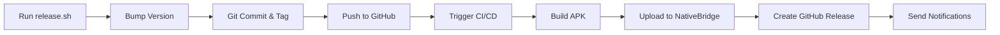

# CI/CD & NativeBridge Integration Documentation

Welcome to the NativeBridge CI/CD documentation! This directory contains all the guides you need to understand and use the automated build and deployment pipeline.

## 📚 Documentation Files

### 🚀 Quick Start

**[QUICKSTART_CICD.md](../QUICKSTART_CICD.md)** - Start here!
- Quick overview of the release process
- How to create releases with one command
- Testing and troubleshooting tips
- **Perfect for:** First-time users

### 🔧 NativeBridge Integration

**[NATIVEBRIDGE_CICD.md](NATIVEBRIDGE_CICD.md)** - Project-specific guide
- How NativeBridge is integrated into THIS project
- Setup instructions for GitHub Secrets
- Configuration options
- Troubleshooting specific to this pipeline
- **Perfect for:** Team members working on this project

**[NATIVEBRIDGE_API_INTEGRATION.md](NATIVEBRIDGE_API_INTEGRATION.md)** - General guide
- Integrate NativeBridge into ANY CI/CD platform
- Examples for 8+ platforms (GitHub Actions, Jenkins, GitLab, etc.)
- Reusable code snippets
- Best practices
- **Perfect for:** Using NativeBridge in other projects

### 📖 Reference Documentation

**[application_upload_api.md](workflows/application_upload_api.md)** - Complete API reference
- Full API documentation
- All parameters explained
- Response formats
- Example scenarios
- **Perfect for:** Deep dive into the API

**[SECRETS_SETUP.md](SECRETS_SETUP.md)** - GitHub Secrets guide
- How to configure secrets
- Security best practices
- Production vs development setup
- **Perfect for:** Setting up GitHub Secrets

### 📋 Release Documentation

**[RELEASE_AUTOMATION.md](../RELEASE_AUTOMATION.md)** - Release script guide
- How the `release.sh` script works
- Usage examples
- Troubleshooting
- **Perfect for:** Understanding the release process

---

## 🎯 What is NativeBridge?

**NativeBridge** is a revolutionary cloud platform that lets you **run Android apps instantly in your browser** without any installation:

### Key Features

- ☁️ **Cloud Emulators** - Test on virtual Android devices instantly in your browser
- 📱 **Real Physical Devices** - Run on actual Android hardware in the cloud
- 🚀 **One-Click Launch** - No setup, no downloads, just click and test
- 🌐 **Universal Access** - Works on Windows, Mac, Linux, even mobile browsers
- 🔗 **Shareable Magic Links** - Send links to anyone for instant testing
- 📧 **Email Notifications** - Automatic notifications when new versions are uploaded
- 🔒 **Access Control** - Public or private apps with user allowlists

### How It Works

1. **Upload APK** via API (automated in CI/CD)
2. **Get Magic Link** instantly
3. **Share Link** with your team
4. **Run App** in cloud emulator or real device
5. **Test Anywhere** - no installation required!

---

## 🚀 Quick Setup Guide

### Step 1: Get NativeBridge API Key

1. Log in to [NativeBridge](https://nativebridge.io)
2. Go to **API Keys**: https://nativebridge.io/dashboard/api-keys
3. Click **Generate New API Key** or **Create API Key**
4. Copy the API key

### Step 2: Add to GitHub Secrets

1. Go to your repository → **Settings** → **Secrets and variables** → **Actions**
2. Click **New repository secret**
3. Add:
   - **Name:** `NATIVEBRIDGE_API_KEY`
   - **Value:** Your API key from Step 1
4. Click **Add secret**

### Step 3: Create a Release

```bash
./scripts/release.sh 1.0.0
```

That's it! The pipeline will:
- ✅ Build your APK
- ✅ Upload to NativeBridge
- ✅ Generate magic link for cloud testing
- ✅ Create GitHub Release
- ✅ Send email notifications

---

## 📂 File Structure

```
.github/
├── workflows/
│   ├── release-build.yml          # Main CI/CD workflow
│   └── application_upload_api.md  # Complete API documentation
│
├── NATIVEBRIDGE_CICD.md          # Project integration guide
├── NATIVEBRIDGE_API_INTEGRATION.md # General CI/CD guide
├── SECRETS_SETUP.md              # GitHub Secrets setup
└── README.md                      # This file

scripts/
├── release.sh                     # Automated release script
└── README.md                      # Release script documentation

QUICKSTART_CICD.md                 # Quick start guide
RELEASE_AUTOMATION.md              # Release automation guide
BUILD_GUIDE.md                     # Build instructions
```

---

## 🔄 Workflow Overview

### Release Process



### What Happens Automatically

1. **Version Bumping**
   - Updates `package.json`
   - Updates `android/app/build.gradle`
   - Creates git commit

2. **Git Operations**
   - Creates annotated tag
   - Pushes to GitHub
   - Triggers workflow

3. **Build Process**
   - Sets up environment
   - Generates/decodes keystore
   - Builds signed APK
   - Fixes Kotlin compilation issues

4. **NativeBridge Upload**
   - Uploads APK via API
   - Parses response
   - Extracts magic links
   - Saves for later steps

5. **GitHub Release**
   - Downloads APK artifact
   - Creates release
   - Includes NativeBridge cloud link
   - Attaches APK file

6. **Notifications**
   - Email via NativeBridge (if enabled)
   - GitHub notifications
   - Build summaries

---

## 🔑 Required Secrets

### Minimum Setup

| Secret | Required | Description |
|--------|----------|-------------|
| `NATIVEBRIDGE_API_KEY` | **Yes** | API key for NativeBridge uploads |

### Production Setup (Recommended)

| Secret | Required | Description |
|--------|----------|-------------|
| `NATIVEBRIDGE_API_KEY` | **Yes** | API key for NativeBridge uploads |
| `ANDROID_KEYSTORE_BASE64` | No | Base64-encoded release keystore |
| `ANDROID_KEYSTORE_PASSWORD` | No | Keystore password |
| `ANDROID_KEY_ALIAS` | No | Key alias in keystore |
| `ANDROID_KEY_PASSWORD` | No | Key password |

> **Note:** If keystore secrets are not provided, the workflow generates a temporary keystore for CI builds.

---

## 📝 Usage Examples

### Create Release (Standard)

```bash
# Bump to version 1.0.0 and create release
./scripts/release.sh 1.0.0
```

### Dry Run (Test Without Pushing)

```bash
# See what would happen without actually releasing
./scripts/release.sh 1.0.0 --dry-run
```

### npm Scripts

```bash
# Standard release
npm run release 1.0.0

# Dry run
npm run release:dry 1.0.0
```

### Manual Build

```bash
# Build debug APK locally
cd android && ./gradlew assembleDebug

# Build release APK locally
cd android && ./gradlew assembleRelease
```

---

## 🎯 Common Use Cases

### Testing Internally

```yaml
# Make app private for internal testing
-F "accessType=private" \
-F "allowedUsers=dev@company.com" \
-F "allowedUsers=qa@company.com"
```

### QA Team Notifications

```yaml
# Send notifications to QA team
-F "sendNotification=true" \
-F "notificationEmails=qa@company.com" \
-F "notificationEmails=product@company.com"
```

### Staging vs Production

```yaml
# Create separate app entry for staging
-F "versionAction=create_new_app"
```

---

## 🔧 Troubleshooting

### API Key Issues

**Problem:** "NATIVEBRIDGE_API_KEY secret not configured"

**Solution:**
1. Verify secret is added to GitHub Secrets
2. Check secret name is exactly `NATIVEBRIDGE_API_KEY`
3. Re-run the workflow

### Build Failures

**Problem:** Kotlin compilation errors

**Solution:**
- Workflow includes automatic patches
- If still fails, check Android Gradle plugin compatibility
- Review workflow logs for specific errors

### Upload Failures

**Problem:** API returns 401 Unauthorized

**Solution:**
1. Verify API key is correct
2. Check for extra spaces/newlines in secret
3. Regenerate API key if needed

**Problem:** API returns 429 Rate Limit

**Solution:**
- Wait 60 seconds before retrying
- NativeBridge allows 10 requests/minute

---

## 📖 Learn More

### NativeBridge Resources

- **Website:** https://nativebridge.io
- **Dashboard:** https://nativebridge.io/dashboard
- **API Keys:** https://nativebridge.io/dashboard/api-keys
- **Documentation:** https://docs.nativebridge.io

### CI/CD Resources

- **GitHub Actions Docs:** https://docs.github.com/actions
- **This Project's Workflow:** [workflows/release-build.yml](workflows/release-build.yml)
- **Quick Start:** [QUICKSTART_CICD.md](../QUICKSTART_CICD.md)

---

## 🤝 Support

### Project-Specific Issues

- Check [NATIVEBRIDGE_CICD.md](NATIVEBRIDGE_CICD.md) troubleshooting section
- Review GitHub Actions logs
- Check this README

### NativeBridge API Issues

- Read [workflows/application_upload_api.md](workflows/application_upload_api.md)
- Contact: api-support@nativebridge.io
- Dashboard: https://nativebridge.io/dashboard

### General Integration Help

- See [NATIVEBRIDGE_API_INTEGRATION.md](NATIVEBRIDGE_API_INTEGRATION.md)
- Examples for your CI/CD platform
- Best practices guide

---

## ✨ Benefits of This Setup

### For Developers

- ✅ **One Command Release** - `./scripts/release.sh 1.0.0`
- ✅ **Automatic Versioning** - No manual file editing
- ✅ **Signed APKs** - Production-ready builds
- ✅ **Cloud Testing** - Test without installing

### For QA Teams

- ✅ **Instant Access** - Click magic link to test
- ✅ **No Installation** - Run in browser
- ✅ **Real Devices** - Test on actual hardware
- ✅ **Email Notifications** - Know when new versions are ready

### For Product Managers

- ✅ **Easy Sharing** - Send links to stakeholders
- ✅ **Version History** - All versions accessible
- ✅ **Quick Demos** - No setup for demonstrations
- ✅ **Cross-Platform** - Share with anyone, any device

---

## 🎓 Getting Started Checklist

- [ ] Read [QUICKSTART_CICD.md](../QUICKSTART_CICD.md)
- [ ] Get NativeBridge API key from https://nativebridge.io/dashboard/api-keys
- [ ] Add `NATIVEBRIDGE_API_KEY` to GitHub Secrets
- [ ] Run `./scripts/release.sh 1.0.0 --dry-run` to test
- [ ] Create first release: `./scripts/release.sh 1.0.0`
- [ ] Check GitHub Actions for build status
- [ ] Test magic link in GitHub Release
- [ ] Share with team!

---

**Last Updated:** 2025-11-29
**Version:** 1.0
**Workflow File:** `workflows/release-build.yml`
