# Release Automation Guide

**Automated release process for NativeBridge application** 🚀

## ✨ What's Automated?

The release script (`scripts/release.sh`) automates the entire release workflow:

1. ✅ Version bumping (package.json, Android)
2. ✅ Running tests
3. ✅ Build verification
4. ✅ Git commit with conventional message
5. ✅ Git tag creation
6. ✅ Pushing to remote
7. ✅ Triggering CI/CD pipeline
8. ✅ Building APK and iOS .app
9. ✅ Creating GitHub Release

## 🚀 Quick Start

### Single Command Release

```bash
# Create release version 1.0.0
./scripts/release.sh 1.0.0
```

That's it! The script handles everything else.

### Using npm Scripts

```bash
# Standard release
npm run release 1.0.0

# Beta release
npm run release:beta 1.0.0-beta

# Dry run (test without changes)
npm run release:dry 1.0.0
```

## 📊 What Happens

```mermaid
graph TD
    A[Run release.sh 1.0.0] --> B[Validate Version]
    B --> C[Check Git Status]
    C --> D[Update package.json]
    D --> E[Update Android build.gradle]
    E --> F[Run Tests]
    F --> G[Verify Android Build]
    G --> H[Commit Changes]
    H --> I[Create Tag v1.0.0]
    I --> J[Push to GitHub]
    J --> K[Trigger CI/CD]
    K --> L[Build APK & iOS .app]
    L --> M[Create GitHub Release]
    M --> N[Done! 🎉]
```



## 📋 Detailed Steps

### Step 1: Version Validation

The script validates the version format:

- ✅ `1.0.0` - Valid semantic version
- ✅ `1.2.3-beta` - Valid pre-release
- ❌ `v1.0.0` - Don't include 'v' prefix
- ❌ `1.0` - Missing patch version

### Step 2: Version Updates

#### package.json

**Before:**
```json
{
  "version": "0.9.0"
}
```

**After:**
```json
{
  "version": "1.0.0"
}
```

#### android/app/build.gradle

**Before:**
```gradle
versionCode 1
versionName "1.0"
```

**After:**
```gradle
versionCode 10000
versionName "1.0.0"
```

**Version Code Calculation:**
- Formula: `MAJOR * 10000 + MINOR * 100 + PATCH`
- `1.0.0` → `10000`
- `1.2.3` → `10203`
- `2.5.1` → `20501`

### Step 3: Testing & Building

```bash
# Runs automatically
npm test
cd android && ./gradlew assembleRelease
```

Skip with `--skip-tests` or `--skip-build` if needed.

### Step 4: Git Operations

#### Commit

```
chore: bump version to 1.0.0

- Updated package.json version
- Updated Android versionCode and versionName
- Preparing for release v1.0.0
```

#### Tag

```
Release v1.0.0

Version: 1.0.0
Date: 2025-11-29 12:30:45
Branch: main
Commit: abc1234

This release includes:
- Android APK: NativeBridge-v1.0.0.apk
- iOS .app: NativeBridge-iOS-v1.0.0.app.zip

Automated build via GitHub Actions CI/CD pipeline.
```

### Step 5: CI/CD Pipeline

GitHub Actions automatically:
1. Builds Android APK (~5-8 min)
2. Builds iOS .app (~10-15 min)
3. Creates GitHub Release
4. Attaches artifacts

**Total time:** ~15-20 minutes

## 🎯 Usage Examples

### Standard Release

```bash
./scripts/release.sh 1.0.0
```

**What it does:**
- ✅ Updates versions
- ✅ Runs tests
- ✅ Verifies build
- ✅ Commits, tags, pushes
- ✅ Triggers CI/CD

### Beta Release

```bash
./scripts/release.sh 1.0.0-beta --prerelease
```

**Marks as pre-release in GitHub**

### Quick Patch (Skip Tests)

```bash
./scripts/release.sh 1.0.1 --skip-tests --skip-build
```

**Use for:**
- Documentation fixes
- Minor hotfixes
- Non-code changes

### Dry Run (No Changes)

```bash
./scripts/release.sh 2.0.0 --dry-run
```

**Shows what would happen without making changes**

### Force Release (Skip Confirmations)

```bash
./scripts/release.sh 1.0.0 --force
```

**Skips all user prompts**

## ⚙️ Available Options

| Option | Description | Use Case |
|--------|-------------|----------|
| `--skip-tests` | Skip npm test | Hotfixes, docs |
| `--skip-build` | Skip Android build | Quick releases |
| `--prerelease` | Mark as pre-release | Beta, alpha |
| `--dry-run` | Show changes only | Testing |
| `--force` | Skip confirmations | Automation |
| `--help` | Show help | Documentation |

## 🔄 Complete Workflow

### 1. Prepare Release

```bash
# Ensure code is ready
git status
git pull origin main

# Run tests locally
npm test

# Build locally (optional)
npm run build:release
```

### 2. Run Release Script

```bash
# Test with dry run
./scripts/release.sh 1.0.0 --dry-run

# If looks good, run for real
./scripts/release.sh 1.0.0
```

### 3. Monitor CI/CD

```bash
# Script shows URL
# https://github.com/your-org/your-repo/actions
```

Watch the build progress in GitHub Actions.

### 4. Download Artifacts

```bash
# After ~15-20 minutes
# https://github.com/your-org/your-repo/releases/tag/v1.0.0
```

Download:
- `NativeBridge-v1.0.0.apk` (Android)
- `NativeBridge-iOS-v1.0.0.app.zip` (iOS)

### 5. Test Builds

```bash
# Android
adb install NativeBridge-v1.0.0.apk

# iOS
unzip NativeBridge-iOS-v1.0.0.app.zip
xcrun simctl install booted NativeBridgeDebugApplication.app
```

## 🔐 Security Considerations

### Development Keystore (Default)

The script uses the existing development keystore by default:
- ✅ Fine for testing
- ✅ Fine for internal builds
- ⚠️ **Not for Play Store**

### Production Keystore

For Play Store releases, configure GitHub Secrets:

1. Generate production keystore
2. Add to GitHub Secrets:
   - `ANDROID_KEYSTORE_BASE64`
   - `ANDROID_KEYSTORE_PASSWORD`
   - `ANDROID_KEY_ALIAS`
   - `ANDROID_KEY_PASSWORD`

**Guide:** [.github/SECRETS_SETUP.md](.github/SECRETS_SETUP.md)

## 🐛 Troubleshooting

### Issue: "Invalid version format"

**Fix:** Use semantic versioning

```bash
# ✅ Correct
./scripts/release.sh 1.0.0

# ❌ Wrong
./scripts/release.sh v1.0.0  # Remove 'v'
./scripts/release.sh 1.0     # Add patch version
```

### Issue: "Tag already exists"

**Fix:** Delete tag or use different version

```bash
# Delete tag
git tag -d v1.0.0
git push origin :refs/tags/v1.0.0

# Or use different version
./scripts/release.sh 1.0.1
```

### Issue: "Uncommitted changes"

**Fix:** Commit or stash changes

```bash
# Commit
git add .
git commit -m "Prepare for release"

# Or stash
git stash

# Or force
./scripts/release.sh 1.0.0 --force
```

### Issue: "Tests failed"

**Fix:** Fix tests or skip

```bash
# Fix tests
npm test

# Or skip (not recommended)
./scripts/release.sh 1.0.0 --skip-tests
```

### Issue: "Build failed"

**Fix:** Fix build or skip

```bash
# Fix build
cd android && ./gradlew assembleRelease

# Or skip
./scripts/release.sh 1.0.0 --skip-build
```

## 📚 Documentation

| Document | Purpose |
|----------|---------|
| [scripts/README.md](scripts/README.md) | **Release script documentation** |
| [QUICKSTART_CICD.md](QUICKSTART_CICD.md) | Quick start guide |
| [CICD_GUIDE.md](CICD_GUIDE.md) | Complete CI/CD docs |
| [.github/SECRETS_SETUP.md](.github/SECRETS_SETUP.md) | Keystore configuration |
| [BUILD_GUIDE.md](BUILD_GUIDE.md) | Manual builds |

## 💡 Tips & Best Practices

### 1. Always Dry Run First

```bash
./scripts/release.sh 1.0.0 --dry-run
```

### 2. Follow Semantic Versioning

- **MAJOR** (2.0.0) - Breaking changes
- **MINOR** (1.1.0) - New features
- **PATCH** (1.0.1) - Bug fixes

### 3. Use Pre-release for Testing

```bash
# Test release
./scripts/release.sh 1.0.0-beta

# Production release
./scripts/release.sh 1.0.0
```

### 4. Don't Skip Tests in Production

```bash
# ✅ Good
./scripts/release.sh 1.0.0

# ⚠️ Only for hotfixes
./scripts/release.sh 1.0.1 --skip-tests
```

### 5. Monitor Build Status

Always check GitHub Actions after releasing to ensure builds succeed.

## 🎉 Summary

**Single command releases:**
```bash
./scripts/release.sh 1.0.0
```

**Automated:**
- Version bumping
- Testing
- Building
- Committing
- Tagging
- Pushing
- CI/CD trigger
- APK & iOS .app creation
- GitHub Release

**Time saved:** ~10-15 minutes per release!

---

**Ready to automate your releases?**

```bash
./scripts/release.sh 1.0.0 --dry-run
```

For detailed documentation, see [scripts/README.md](scripts/README.md)
